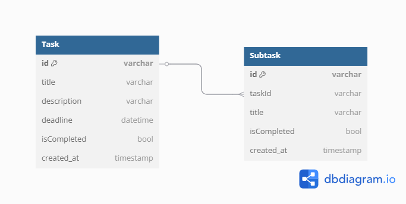

# to_do_list

## API Service
This project uses [MockAPI](https://mockapi.io/) as the backend for managing tasks.  
MockAPI provides a simple and free API for testing CRUD operations in the app.

### **Base URL**
https://67ab2a7b65ab088ea7e8eeb4.mockapi.io

### **API Endpoints**
#### **Tasks**
| Method | Endpoint                      | Description               |
|--------|--------------------------------|---------------------------|
| GET    | `/task`                        | Get all tasks            |
| GET    | `/task/{id}`                   | Get a task by ID         |
| POST   | `/task`                        | Create a new task        |
| PUT    | `/task/{id}`                   | Update an existing task  |
| DELETE | `/task/{id}`                   | Delete a task            |

#### **Subtasks**
| Method | Endpoint                            | Description                   |
|--------|--------------------------------------|-------------------------------|
| GET    | `/task/{task_id}/subtask`           | Get all subtasks for a task  |
| GET    | `/task/{task_id}/subtask/{id}`      | Get a subtask by ID          |
| POST   | `/task/{task_id}/subtask`           | Create a new subtask         |
| PUT    | `/task/{task_id}/subtask/{id}`      | Update a subtask             |
| DELETE | `/task/{task_id}/subtask/{id}`      | Delete a subtask             |

## Entity-Relationship Diagram (ERD)

